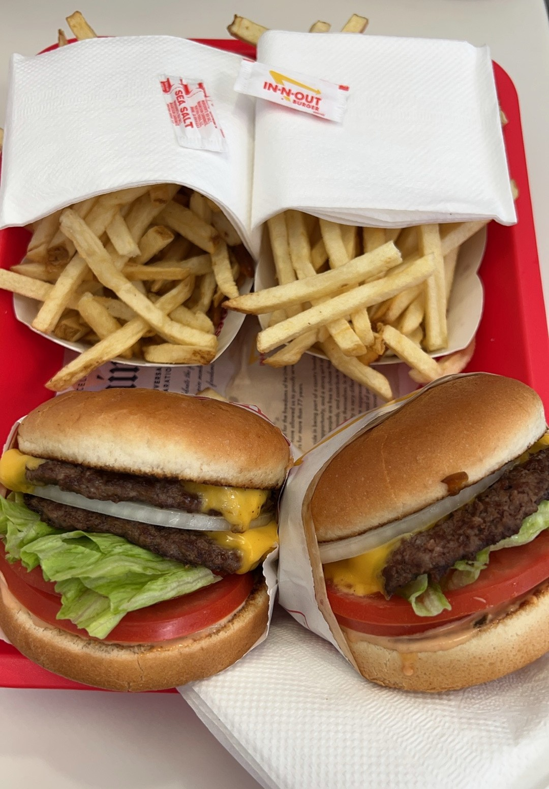
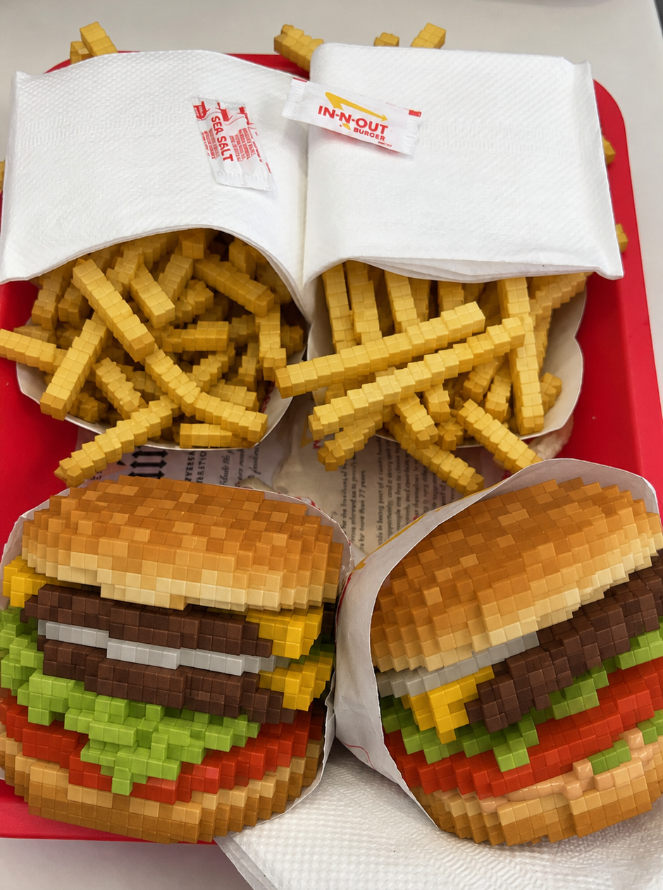
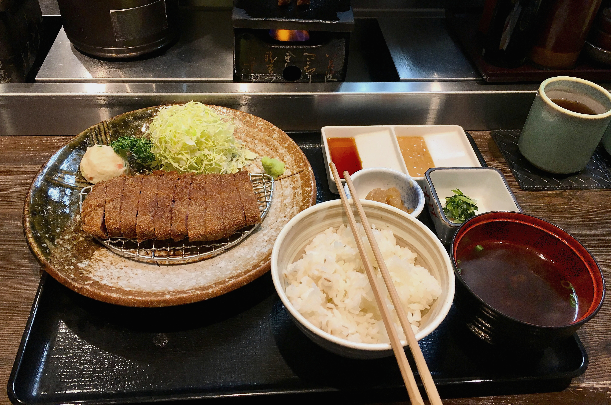
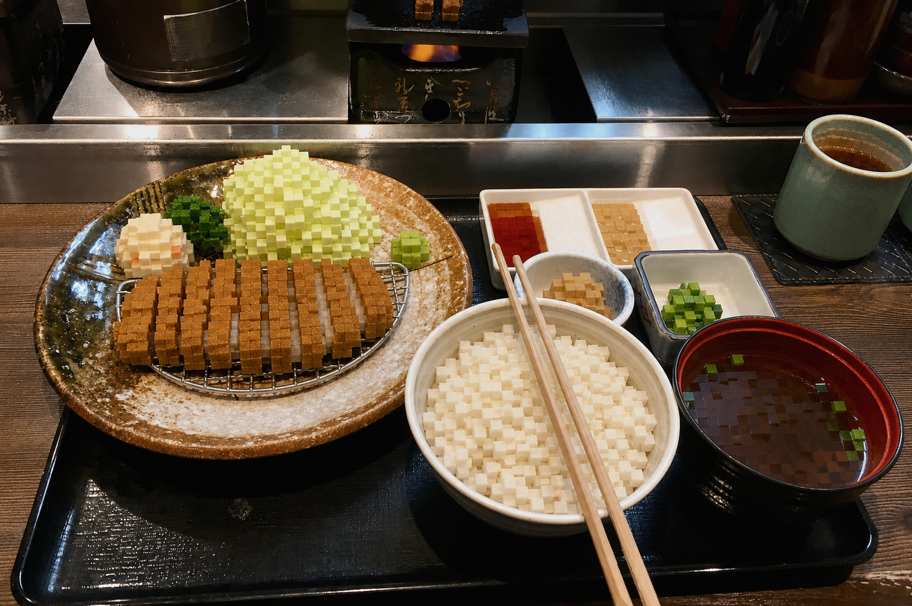

# Voxel Food Photo Editor

## 中文

把食物或饮品照片做成「真实世界 × 像素体素食物」效果：只有可食用的内容变为能辨认的方块体素版本，其他部分保持真实。

### 保留什么

- 菜品或饮品本身的数量、外形、层次、配料、颜色、摆放和透视关系。
- 人物、手部、服装、餐具、包装、家具、环境、光线、阴影和镜头构图。

默认只像素化食物与饮品内容；盘子、碗、杯子、玻璃杯、筷子、刀叉、托盘、包装纸和餐巾都保持真实。

### 可选：食物＋容器模式

仅当用户明确说 **“餐具也像素化”** 时启用。此时食物及其直接关联的容器／餐具可以一起重建成体素物体；没有这句明确要求时，所有容器和餐具必须保持真实。

### 使用方式

把一张或多张食物照片交给 Codex，并要求使用 `$voxel-food-photo-editor`。它会处理每一张可读取图片，为每张图保存一份克制的预处理版本和一份最终体素版本。

---

## English

Turn food and drink photographs into reality-versus-voxel edits: only the edible contents become recognizable, block-built voxel versions of themselves. Everything else remains photorealistic.

### What it preserves

- The actual dish or drink: its count, shape, layers, toppings, colours, placement, and perspective.
- People, hands, clothing, tableware, packaging, furniture, environment, lighting, shadows, and camera composition.

By default, only food and drink contents are voxelized. Plates, bowls, cups, glasses, chopsticks, cutlery, trays, wrappers, and napkins remain real.

### Optional food + vessels mode

Enable this mode only when the user explicitly says **“voxelize the tableware too.”** In that case, edible contents and their directly associated containers or tableware may be rebuilt as voxel objects. Without that explicit request, keep every vessel and utensil photorealistic.

### Use

Ask Codex to use `$voxel-food-photo-editor` with one or more food photographs. It processes every readable image supplied, saving a restrained preprocessed copy and one final voxel edit per image.

---

## 示例 / Examples

### 汉堡与薯条 / Burgers and fries

| 预处理前 / Before preprocessing | 仅食物像素化 / Food-only voxel edit |
| --- | --- |
|  |  |

### 多盘料理 / Multi-dish meal

**预处理前 / Before preprocessing**

**仅食物像素化 / Food-only voxel edit**

## License / 授权

This skill and the included examples are available for personal, non-commercial use only. / 本 skill 及所附示例仅限个人、非商业用途。 See [LICENSE](LICENSE).
